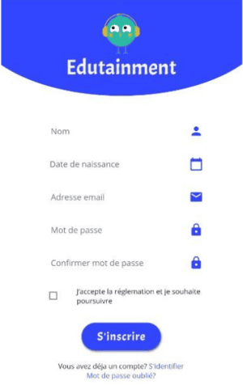
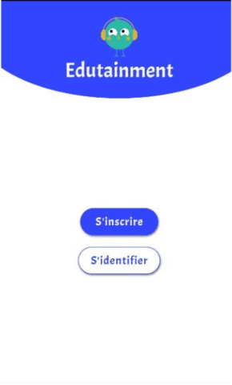
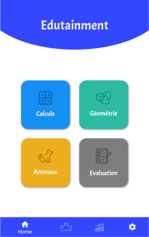
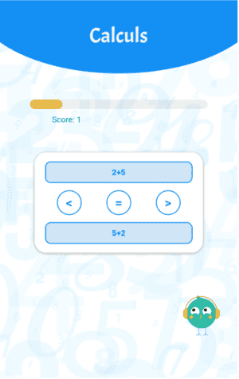
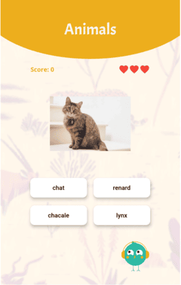
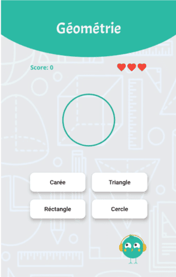
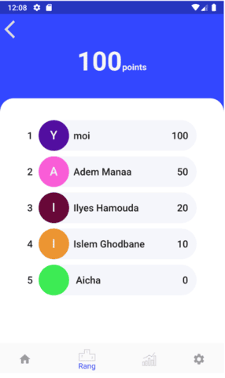
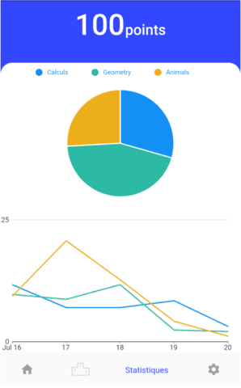

## **Edutainment: A Fun and Engaging Learning Experience**

**A Flutter mobile application designed to make learning fun for children.**

### **Introduction**
Edutainment is a mobile application developed by a team of five second-year students from the Higher National School of Algiers (ESI - Alger). It offers a playful and interactive learning experience for children, covering math, geometry, and animal facts through engaging quizzes and games.

### **Features**
* **Interactive Quizzes:** Engaging quizzes on math, geometry, and animal facts.
* **Adaptive Learning:** Tailored questions based on the child's performance.
* **Progress Tracking:** Monitors the child's learning progress and provides personalized feedback.
* **Gamified Learning:** Incorporates game-like elements to make learning fun and rewarding.
* **Offline Functionality:** Allows users to play without an internet connection.
* **Parental Controls:** Provides parents with the ability to monitor their child's progress and customize the learning experience.

### **Getting Started**
#### **Prerequisites:**
* **Flutter:** Ensure you have Flutter installed on your system. Refer to the official Flutter documentation for installation instructions: [https://flutter.dev/](https://flutter.dev/)
* **Android Studio or VS Code:** A code editor or IDE to develop the app.

#### **Cloning the Repository:**
```bash
git clone https://github.com/lyes-mersel/edutainment.git
```

#### **Running the App:**
1. **Open the project:** Open the cloned project in your preferred IDE (Android Studio or VS Code).
2. **Connect a device or start an emulator:** Ensure you have a physical device or emulator set up.
3. **Run the app:** Click the "Run" button in your IDE to start the app.

### **Technologies Used**
* **Flutter:** For building beautiful, natively compiled applications for mobile, web, and desktop from a single codebase.
* **Dart:** The programming language used to build Flutter apps.
* **Firebase:** For backend services such as authentication, cloud storage, and real-time database.

### **Team Members**
* **CHETTAB Yacine** (Project Leader)
* **GHODBANE Youcef Islam**
* **HAMOUDA Iyas**
* **MANAA Adem**
* **MERSEL Lyes**

### **Contributing**
We welcome contributions to Edutainment! If you'd like to contribute, please follow these steps:
1. Fork the repository.
2. Create a new branch.
3. Make your changes.
4. Commit your changes.
5. Push to the branch.
6. Create a pull request.

### **License**
This project is licensed under the MIT License - see the LICENSE file for details.

### **Screenshots**
|  |  |  |  |
| -------| ------- | ------- | ------- |
|  |  |  |  |
|  |  |  |  |

